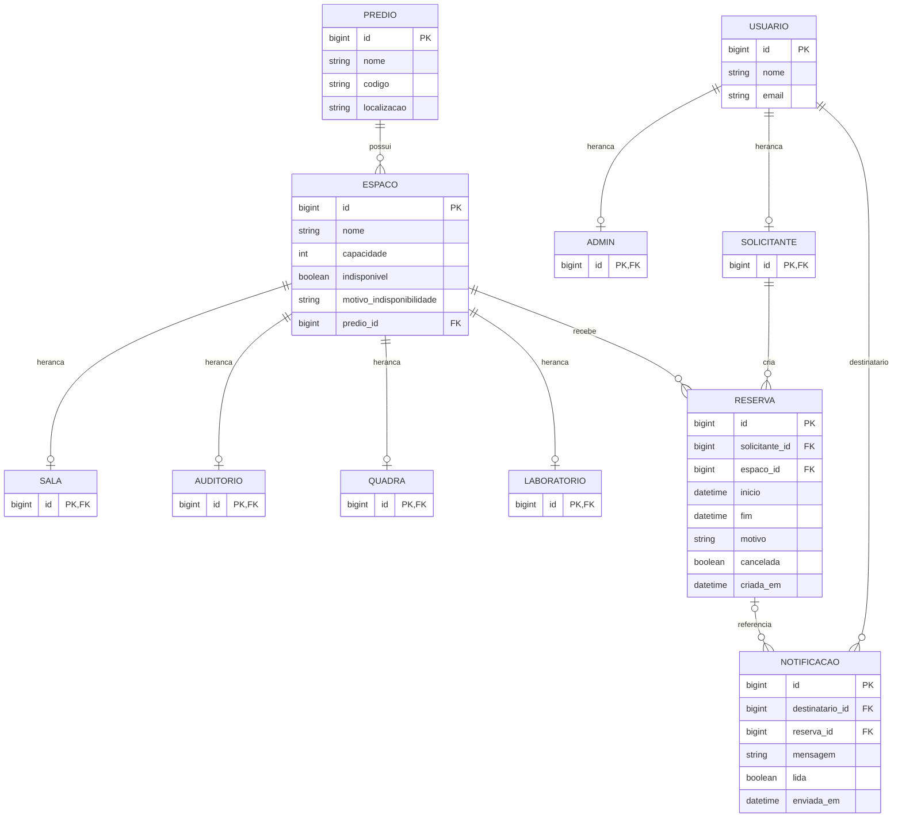

# Classroom Scheduler

Sistema para agendamento de espacos da faculdade, com foco em evitar conflitos de horario e manter as regras de reserva bem definidas no dominio.

## Objetivo

O projeto organiza o processo de reserva de espacos academicos de forma simples e clara. A proposta prioriza:

- modelagem de dominio bem estruturada
- separacao de responsabilidades entre camadas
- regras de negocio centralizadas
- API REST para operacoes principais de consulta, reserva e notificacao

## Escopo funcional

### Solicitante

- Ver espacos disponiveis
- Filtrar espacos por capacidade, tipo e predio
- Criar reserva
- Cancelar a propria reserva
- Consultar suas reservas
- Receber notificacoes sobre alteracoes nas reservas

### Admin

- Criar espacos
- Definir capacidade e localizacao
- Marcar indisponibilidade de espacos
- Cancelar qualquer reserva
- Consultar notificacoes emitidas pelo sistema

## Dominio do problema

O sistema foi planejado para destacar conceitos importantes de orientacao a objetos e modelagem:

- Heranca em `Usuario`, com especializacoes `Admin` e `Solicitante`
- Generalizacao em `Espaco`, com especializacoes `Sala`, `Auditorio`, `Quadra` e `Laboratorio`
- Composicao entre `Reserva` e `Horarios`
- Associacoes entre `Espaco`, `Predio` e `Notificacao`
- Regras de reserva centralizadas no dominio

Os principais elementos do dominio sao:

- `Usuario`
- `Admin`
- `Solicitante`
- `Predio`
- `Reserva`
- `Horarios`
- `Notificacao`
- `Espaco`
- `Sala`
- `Auditorio`
- `Quadra`
- `Laboratorio`

## Diagrama de classes

O modelo conceitual possui as classes do dominio, mas a persistencia em banco segue o mapeamento JPA atual. Como `Horarios` esta marcado com `@Embeddable`, ele nao vira tabela propria: os campos `inicio` e `fim` ficam na tabela `reserva`.



## Regras de negocio centrais

- Nao pode existir reserva em conflito de horario para o mesmo espaco
- Nao pode reservar espaco indisponivel
- `Horarios` deve ser valido, com fim posterior ao inicio
- Nao pode criar reserva no passado
- O `Solicitante` pode cancelar apenas a propria reserva
- O `Admin` pode cancelar qualquer reserva
- O sistema deve gerar `Notificacao` em eventos relevantes da reserva

## Arquitetura

O projeto segue uma arquitetura em camadas com Spring Boot:

- `controller`: recebe e responde requisicoes HTTP
- `service`: aplica regras de negocio e coordenacao de casos de uso
- `repository`: acesso aos dados com Spring Data JPA
- `model`: entidades e objetos de valor do dominio
- `dto`: contratos de entrada e saida da API
- `exception`: tratamento padronizado de erros

Estrutura atual do codigo:

```text
src/main/java/com/classroomscheduler
|-- controller
|-- dto
|-- exception
|-- model
|-- repository
|-- service
`-- ApiApplication.java
```

## Endpoints atuais

### Espacos

- `GET /espacos`
- `GET /espacos/disponiveis`
- `GET /espacos/por-predio?predioId=...`
- `POST /espacos`
- `PATCH /espacos/{id}/indisponibilidade`

### Reservas

- `POST /reservas`
- `GET /reservas`
- `GET /reservas/{id}`
- `GET /reservas/ativas`
- `GET /reservas/por-solicitante?solicitanteId=...`
- `PATCH /reservas/{id}/cancelar`

### Solicitantes, usuarios e notificacoes

- `GET /solicitantes`
- `POST /solicitantes`
- `GET /usuarios`
- `GET /notificacoes`
- `POST /notificacoes`
- `PATCH /notificacoes/{id}/lida`

Os detalhes de contratos e exemplos estao em [docs/endpoints.md](/C:/Users/Usuario/Documents/Insper/arq_obj/Agendamento/docs/endpoints.md).

## Como executar

Pre-requisitos:

- JDK instalado
- `JAVA_HOME` configurado
- Java 25, conforme `pom.xml`

Executar a aplicacao:

```powershell
.\mvnw spring-boot:run
```

Por padrao, a aplicacao sobe com uma seed local de demonstracao habilitada. Ela cria:

- um `Admin` padrao
- dois `Predios`
- quatro `Espacos`
- dois `Solicitantes`
- uma `Reserva` futura de exemplo
- `Notificacoes` iniciais para explorar a API

Para desligar a seed local, defina:

```powershell
$env:APP_DEMO_DATA_ENABLED='false'
.\mvnw spring-boot:run
```

Executar testes:

```powershell
.\mvnw test
```

Aplicacao local:

```text
http://localhost:8080
```

Documentacao OpenAPI / Swagger UI:

```text
http://localhost:8080/docs/swagger-ui.html
```

## Banco de dados

O projeto esta configurado com H2 em memoria em [src/main/resources/application.properties](/C:/Users/Usuario/Documents/Insper/arq_obj/Agendamento/src/main/resources/application.properties).

- JDBC URL: `jdbc:h2:mem:testdb`
- Usuario: `sa`
- Senha: em branco
- Console H2 habilitado

Console H2:

```text
http://localhost:8080/h2-console
```

Como o banco esta em memoria, os dados sao perdidos ao encerrar a aplicacao.

## Documentacao complementar

- [Modelagem de dominio](/C:/Users/Usuario/Documents/Insper/arq_obj/Agendamento/docs/modelagem-de-dominio.md)
- [Regras de negocio](/C:/Users/Usuario/Documents/Insper/arq_obj/Agendamento/docs/regras-de-negocio.md)
- [Endpoints da API](/C:/Users/Usuario/Documents/Insper/arq_obj/Agendamento/docs/endpoints.md)
- [Contrato OpenAPI](/C:/Users/Usuario/Documents/Insper/arq_obj/Agendamento/docs/openapi.json)
- [Collection Postman](/C:/Users/Usuario/Documents/Insper/arq_obj/Agendamento/docs/api-collection.postman_collection.json)
- [Backlog do produto](/C:/Users/Usuario/Documents/Insper/arq_obj/Agendamento/docs/backlog-do-produto.md)
- [Padrao de commits e PRs](/C:/Users/Usuario/Documents/Insper/arq_obj/Agendamento/docs/padrao-de-commits-e-prs.md)

## Observacao

Esta documentacao agora usa como base as classes obrigatorias do projeto e deve servir como guia direto para a implementacao do dominio.
