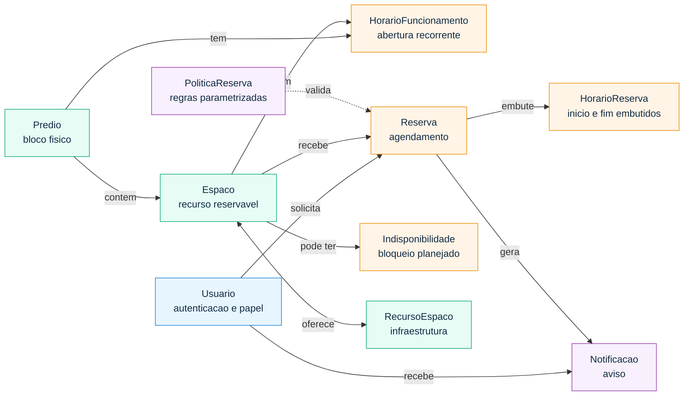

# Classroom Scheduler

Sistema para agendamento de espacos da faculdade, com foco em evitar conflitos de horario e manter as regras de reserva bem definidas no dominio.

## Objetivo

O projeto organiza o processo de reserva de espacos academicos de forma simples e clara. A proposta prioriza:

- modelagem de dominio bem estruturada
- separacao de responsabilidades entre camadas
- regras de negocio centralizadas
- API REST para operacoes principais de consulta, reserva e notificacao
- autenticacao com JWT para solicitantes e administradores

## Escopo funcional

### Solicitante

- Ver espacos disponiveis
- Filtrar espacos por capacidade, tipo e predio
- Criar reserva
- Cancelar a propria reserva
- Consultar suas reservas
- Receber notificacoes sobre alteracoes nas reservas

### Admin

- Criar espacos
- Definir capacidade e localizacao
- Marcar indisponibilidade de espacos
- Cancelar qualquer reserva
- Consultar notificacoes emitidas pelo sistema
- Criar e acompanhar reservas usando sua propria conta administrativa

## Dominio do problema

O sistema foi ajustado para usar classes de dominio com responsabilidade real, evitando subclasses vazias. `Admin` e `Solicitante` agora sao valores do campo `papel` em `Usuario`; `Sala`, `Auditorio`, `Quadra` e `Laboratorio` sao valores do campo `tipo` em `Espaco`.

- `Usuario` concentra autenticacao, papel e tipo de solicitante
- `Espaco` concentra os dados reservaveis e usa `TipoEspaco` para diferenciar sala, auditorio, quadra e laboratorio
- `HorarioFuncionamento` representa dias e janelas de abertura de predios e espacos
- `Reserva` usa `HorarioReserva` para encapsular inicio, fim e validacao temporal
- `Indisponibilidade`, `RecursoEspaco`, `PoliticaReserva` e `Notificacao` deixam regras operacionais explicitas no dominio
- Regras de reserva centralizadas no dominio

As 10 classes de dominio sao:

- `Usuario`
- `Predio`
- `Espaco`
- `HorarioFuncionamento`
- `Reserva`
- `HorarioReserva`
- `Indisponibilidade`
- `RecursoEspaco`
- `Notificacao`
- `PoliticaReserva`

## Diagrama de classes

O modelo conceitual abaixo resume as entidades principais. A versao completa, com diagrama de classes detalhado, visao relacional JPA e fluxo de reserva, esta em [docs/modelagem-de-dominio.md](docs/modelagem-de-dominio.md).



## Regras de negocio centrais

- Nao pode existir reserva em conflito de horario para o mesmo espaco
- Nao pode reservar espaco indisponivel
- `HorarioReserva` deve ser valido, com fim posterior ao inicio
- O `Solicitante` pode cancelar apenas a propria reserva
- O `Admin` pode cancelar qualquer reserva
- O `Admin` tambem pode criar reservas associadas a sua propria conta
- O sistema deve gerar `Notificacao` em eventos relevantes da reserva

## Autenticacao e acesso

A API usa JWT. As rotas publicas principais sao:

- `POST /auth/register`
- `POST /auth/login`
- `GET /health`
- Swagger/OpenAPI e console H2 local

As demais rotas exigem header:

```http
Authorization: Bearer <token>
```

Registro rapido:

```json
{
  "email": "aluno@al.insper.edu.br",
  "senha": "senha123"
}
```

Regras do registro:

- emails `@al.insper.edu.br` viram `Usuario` com `papel = SOLICITANTE` e `tipoSolicitante = ALUNO`
- emails `@insper.edu.br` viram `Usuario` com `papel = SOLICITANTE` e `tipoSolicitante = FUNCIONARIO`
- senhas sao armazenadas com BCrypt em `senhaHash`
- a resposta nunca retorna `senhaHash`

Login:

```json
{
  "email": "admin@insper.edu.br",
  "senha": "admin1234"
}
```

Resposta de autenticacao:

```json
{
  "token": "...",
  "usuario": {
    "id": 1,
    "email": "admin@insper.edu.br",
    "papel": "ADMIN",
    "tipoSolicitante": null
  }
}
```

## Arquitetura

O projeto segue uma arquitetura em camadas com Spring Boot:

- `controller`: recebe e responde requisicoes HTTP
- `service`: aplica regras de negocio e coordenacao de casos de uso
- `repository`: acesso aos dados com Spring Data JPA
- `model`: entidades e objetos de valor do dominio
- `dto`: contratos de entrada e saida da API
- `exception`: excecoes de dominio/API e tratamento padronizado de erros

Estrutura atual do codigo:

```text
src/main/java/com/classroomscheduler
|-- controller
|-- dto
|-- exception
|-- model
|-- repository
|-- service
`-- ApiApplication.java
```

## Endpoints atuais

### Auth

- `POST /auth/register`
- `POST /auth/login`
- `GET /auth/me`

### Espacos

- `GET /espacos`
- `GET /espacos/disponiveis`
- `GET /espacos/por-predio?predioId=...`
- `POST /espacos`
- `PATCH /espacos/{id}/indisponibilidade`

### Reservas

- `POST /reservas`
- `GET /reservas`
- `GET /reservas/{id}`
- `GET /reservas/ativas`
- `GET /reservas/por-solicitante?solicitanteId=...`
- `PATCH /reservas/{id}/cancelar`

### Solicitantes, usuarios e notificacoes

- `GET /solicitantes`
- `POST /solicitantes`
- `GET /usuarios`
- `GET /notificacoes`
- `POST /notificacoes`
- `PATCH /notificacoes/{id}/lida`

Os detalhes de contratos e exemplos estao em [docs/endpoints.md](docs/endpoints.md).

## Como executar

Pre-requisitos:

- JDK instalado
- `JAVA_HOME` configurado
- Java 25, conforme `pom.xml`

Executar a aplicacao:

```powershell
.\mvnw spring-boot:run
```

Por padrao, a aplicacao sobe com uma seed local de demonstracao habilitada. Ela cria:

- um usuario admin padrao (`admin@insper.edu.br` / `admin1234`)
- dois `Predios`
- quatro `Espacos`
- horarios de funcionamento dos predios e de espacos de demonstracao
- recursos de espaco e uma politica padrao de reserva
- dois usuarios solicitantes
- uma `Reserva` futura para solicitante
- uma `Reserva` futura para admin
- `Notificacoes` iniciais para explorar a API

Variaveis uteis:

```powershell
$env:APP_ADMIN_NOME='Administrador Padrao'
$env:APP_ADMIN_EMAIL='admin@insper.edu.br'
$env:APP_ADMIN_PASSWORD='admin1234'
$env:APP_JWT_SECRET='dev-secret-key-change-me-dev-secret-key-change-me'
$env:APP_JWT_EXPIRATION_MILLIS='7200000'
```

Para desligar a seed local, defina:

```powershell
$env:APP_DEMO_DATA_ENABLED='false'
.\mvnw spring-boot:run
```

Executar testes:

```powershell
.\mvnw test
```

Aplicacao local:

```text
http://localhost:8080
```

Documentacao OpenAPI / Swagger UI:

```text
http://localhost:8080/docs/swagger-ui.html
```

## Banco de dados

O projeto esta configurado com H2 em memoria em [src/main/resources/application.properties](src/main/resources/application.properties).

- JDBC URL: `jdbc:h2:mem:testdb`
- Usuario: `sa`
- Senha: em branco
- Console H2 habilitado

Console H2:

```text
http://localhost:8080/h2-console
```

Como o banco esta em memoria, os dados sao perdidos ao encerrar a aplicacao.

## Documentacao complementar

- [Modelagem de dominio](docs/modelagem-de-dominio.md)
- [Regras de negocio](docs/regras-de-negocio.md)
- [Endpoints da API](docs/endpoints.md)
- [Contrato OpenAPI](docs/openapi.json)
- [Collection Postman](docs/api-collection.postman_collection.json)
- [Backlog do produto](docs/backlog-do-produto.md)
- [Padrao de commits e PRs](docs/padrao-de-commits-e-prs.md)

## Observacao

Esta documentacao usa como base as classes de dominio do projeto e deve servir como guia direto para a implementacao.
