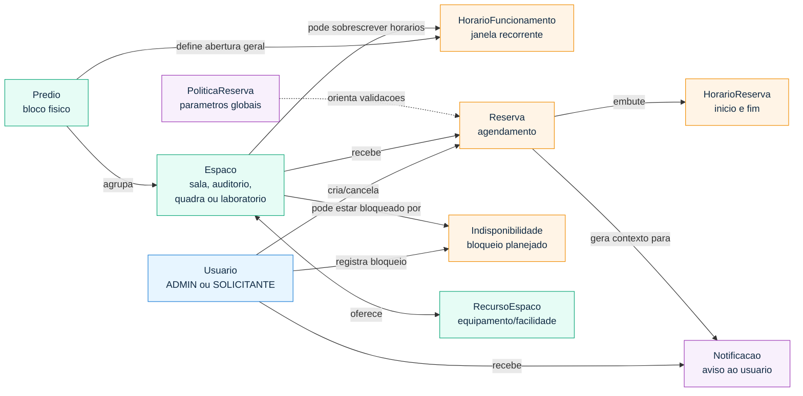
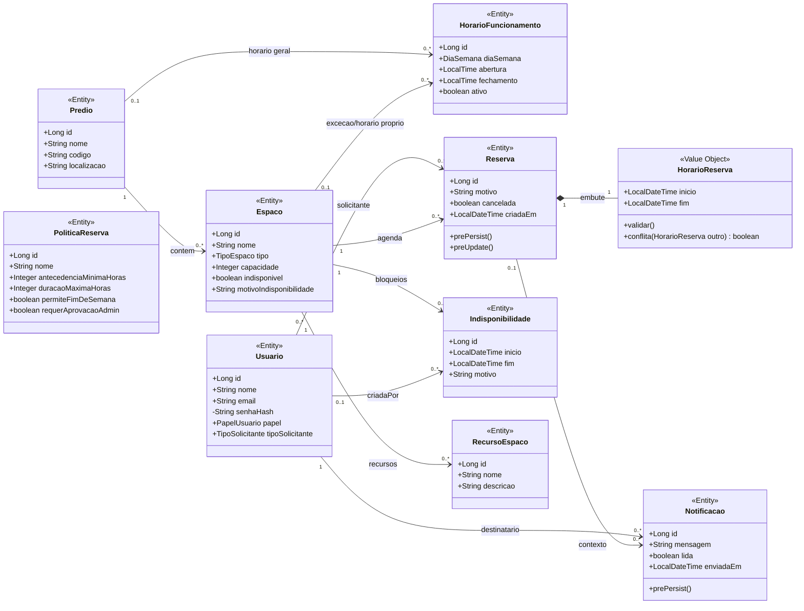
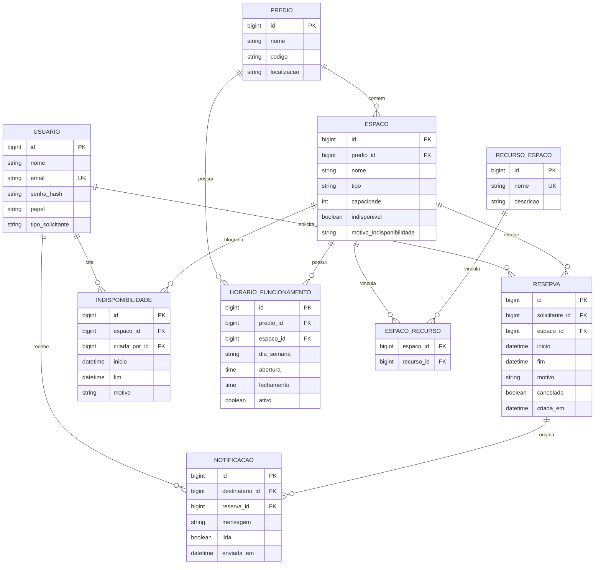
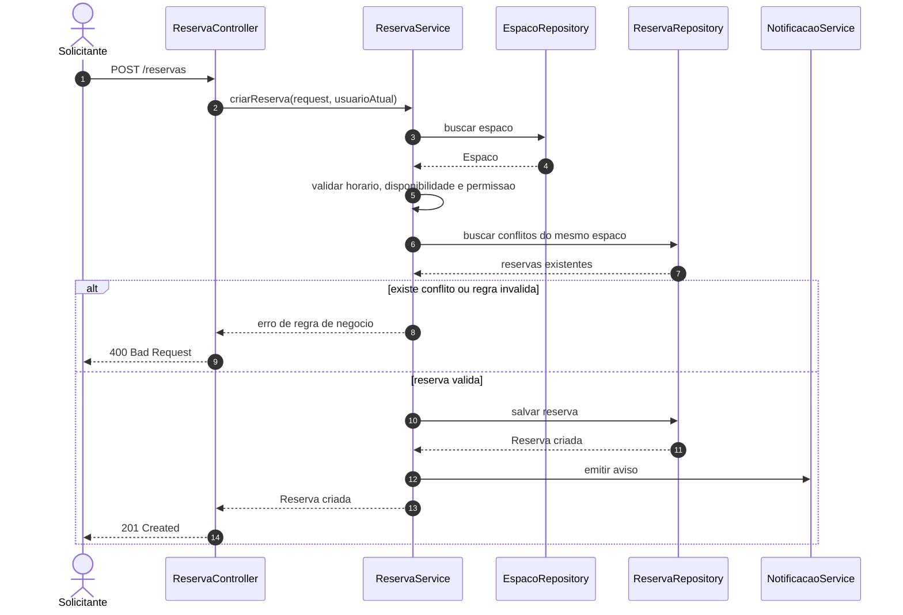

# Modelagem de Dominio

## Visao geral

O `Classroom Scheduler` foi modelado para resolver agendamento de espacos com 10 classes de dominio que carregam responsabilidades reais. A decisao atual evita subclasses vazias: `Admin` e `Solicitante` sao papeis de `Usuario`, enquanto `Sala`, `Auditorio`, `Quadra` e `Laboratorio` sao tipos de `Espaco`.

Enums de apoio:

- `PapelUsuario`: `ADMIN` ou `SOLICITANTE`
- `TipoSolicitante`: `ALUNO` ou `FUNCIONARIO`
- `TipoEspaco`: `SALA`, `AUDITORIO`, `QUADRA` ou `LABORATORIO`
- `DiaSemana`: dias usados em horario de funcionamento

## As 10 classes de dominio

### `Usuario`

Representa qualquer pessoa autenticada no sistema.

- Mantem `nome`, `email`, `senhaHash`, `papel` e `tipoSolicitante`
- Define permissao por `papel`, sem precisar de classe `Admin` ou `Solicitante`
- Para solicitantes, o tipo e inferido pelo dominio do email institucional

### `Predio`

Representa o bloco ou edificio fisico.

- Agrupa espacos por localizacao
- Possui horarios de funcionamento proprios
- Permite filtros e organizacao operacional

### `Espaco`

Representa qualquer recurso fisico reservavel.

- Usa `tipo` para identificar sala, auditorio, quadra ou laboratorio
- Mantem capacidade, disponibilidade e motivo de indisponibilidade
- Pertence a um predio
- Pode possuir recursos, horarios especificos e indisponibilidades

### `HorarioFuncionamento`

Representa dias e janelas de abertura.

- Pode estar ligado a um predio ou a um espaco
- Usa `DiaSemana`, `abertura`, `fechamento` e `ativo`
- Permite diferenciar funcionamento geral do predio e excecoes por espaco

### `Reserva`

Representa o agendamento feito por um usuario.

- Liga `Usuario` e `Espaco`
- Guarda motivo, cancelamento e data de criacao
- Compoe `HorarioReserva` para validar inicio/fim

### `HorarioReserva`

Objeto embutido em `Reserva`.

- Encapsula `inicio` e `fim`
- Valida que `fim` e posterior ao `inicio`
- Oferece logica de conflito temporal

### `Indisponibilidade`

Representa bloqueios planejados de um espaco.

- Guarda intervalo, motivo e usuario que criou o bloqueio
- E adequada para manutencao, eventos internos ou restricoes temporarias
- Complementa o booleano operacional `indisponivel` de `Espaco`

### `RecursoEspaco`

Representa equipamentos ou facilidades disponiveis no espaco.

- Exemplos: projetor, quadro branco, sistema de som
- Relaciona-se com varios espacos
- Permite filtros futuros por infraestrutura

### `Notificacao`

Representa avisos emitidos aos usuarios.

- Guarda destinatario, reserva opcional, mensagem, leitura e envio
- E usada para eventos de reserva e avisos operacionais

### `PoliticaReserva`

Representa parametros de regra de reserva.

- Define antecedencia minima
- Define duracao maxima
- Indica se fim de semana e permitido
- Indica se aprovacao administrativa e exigida

## Relacoes principais

- `Predio` possui muitos `Espaco`
- `Predio` pode possuir varios `HorarioFuncionamento`
- `Espaco` pode possuir horarios especificos, indisponibilidades e recursos
- `Usuario` cria reservas e recebe notificacoes
- `Reserva` associa um usuario a um espaco e contem um `HorarioReserva`
- `Notificacao` referencia um usuario destinatario e pode referenciar uma reserva

## Visualizacoes do dominio

### Mapa rapido

Esta visao mostra o que existe no dominio e como cada parte participa do agendamento.

### Diagrama de classes

### Visao relacional JPA

Esta leitura ajuda a enxergar quais tabelas e chaves aparecem no banco H2. `HorarioReserva` nao aparece como tabela porque e um objeto embutido em `Reserva`.

### Fluxo principal de reserva

## Decisoes de design

- `Usuario` concreto reduz tabelas e classes sem comportamento proprio.
- `Espaco` concreto com `TipoEspaco` evita subclasses sem atributos diferentes.
- `HorarioFuncionamento` separa disponibilidade recorrente de reservas pontuais.
- `Indisponibilidade` permite registrar bloqueios planejados sem misturar com reserva.
- `HorarioReserva` continua como objeto de valor embutido, concentrando validacao temporal.
- `PoliticaReserva` deixa regras parametrizaveis prontas para evolucao sem espalhar constantes.
